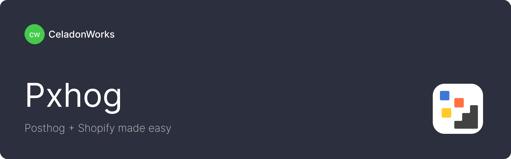

---

# **Pxhog - Shopify + PostHog Made Easy**

Pxhog is a Shopify app designed to simplify and streamline the integration of PostHog analytics for Shopify merchants. Whether you're an experienced developer or a Shopify merchant with little to no coding experience, Pxhog helps you set up PostHog the **right way**, ensuring integration with [Shopify Customer Privacy API](https://shopify.dev/docs/api/customer-privacy) for privacy compliance and using the [Shopify Web Pixels API](https://shopify.dev/docs/api/web-pixels-api).

## **Motiviation**

Integrating PostHog into Shopify can be a challenging and error-prone process, even for seasoned developers. It involves navigating multiple technical steps, understanding complex compliance requirements. This complexity often becomes a **friction point** for merchants exploring PostHog for Shopify.

Pxhog solves these problems by providing:
- **Simplicity**: A seamless setup process that abstracts away the technical complexity.
- **Compliance**: Built-in integration with the [Shopify Customer Privacy API](https://shopify.dev/docs/api/customer-privacy) ensures that all tracking respects user consent, sending anonymized data when necessary or detailed data when permitted.
- **Accessibility**: Makes PostHog accessible to merchants with no coding experience.
- **Efficiency**: Saves developers and merchants hours of integration time into Shopify and reducing the potential for mistakes.

## **Features**

- **Plug-and-Play Integration**: Install Pxhog on your Shopify store and start tracking with PostHog in minutes.
- **Privacy-First Tracking**:
  - Sends anonymized data when user consent is pending or declined.
  - Captures full, detailed data when user consent is granted, fully compliant with GDPR, CCPA, and other privacy laws.
- **Opinionated Defaults**: Comes with a pre-configured setup to track key events like `checkout_completed`, `page_viewed`, and `product_added_to_cart` Web Pixel events.
- **Full Control via GUI**: A flexible graphical interface allows merchants and developers to fine-tune all PostHog configuration properties and [Web Pixels Standard & DOM events](https://shopify.dev/docs/api/web-pixels-api/standard-events), giving you full control over your setup.
- **Documentation Hub**: Accompanies a dedicated documentation site with a clear, opinionated guide on how to use PostHog effectively with Shopify.

## **Who Is Pxhog For?**

Pxhog is for:
1. **Shopify Merchants**: 
   - Especially those with little to no technical experience who want actionable insights without the hassle of a complete setup.
2. **Developers**:
   - Looking to simplify PostHog setup for multiple Shopify stores.
   - Who value compliance and want to avoid reinventing the wheel for every integration.

## **How Pxhog Works**

1. Install Pxhog on your Shopify store.
2. Configure your PostHog API key within the app.
3. Pxhog automatically:
   - Adds Web Pixel to the store.
   - Tracks key events (e.g., `add_to_cart`, `checkout_completed`) using Shopify Web Pixels API.
   - Respects user consent via the [Shopify Customer Privacy API](https://shopify.dev/docs/api/customer-privacy).
   - Optionally: turn on on-site snippet for [Session Replays](https://posthog.com/session-replay) and [Experiments](https://posthog.com/experiments) support.
4. Use the app to customize PostHog configuration properties and Web Pixel events as needed, beyond the default setup.
5. Dive into [PostHog Product Analytics](https://posthog.com/product-analytics) to explore & visualize your data and gain actionable insights.

## **Community-Driven**

Pxhog is community-driven because:
- **Transparency matters**: Merchants and developers can trust the app to handle data responsibly.
- **Collaboration drives innovation**: Feature requests and contributions help make Pxhog better for everyone.

We welcome contributions from the community, whether you're a developer, a Shopify merchant, or an analytics enthusiast.

## **License**

Pxhog is released under the [Functional Source License (FSL)](LICENSE.md), which converts to Apache 2.0 after two years.

**TLDR**:  
- You may use, modify, and commercialize this code to create and host **Custom** or **Unlisted** **Shopify Apps** for private use.  
- You may **NOT** use this code to create or distribute **Public Shopify Apps** listed in the Shopify App Store.

---

Simplify Shopify + PostHog analytics with Pxhog and gain actionable insights faster, smarter, and more compliantly. 🚀
